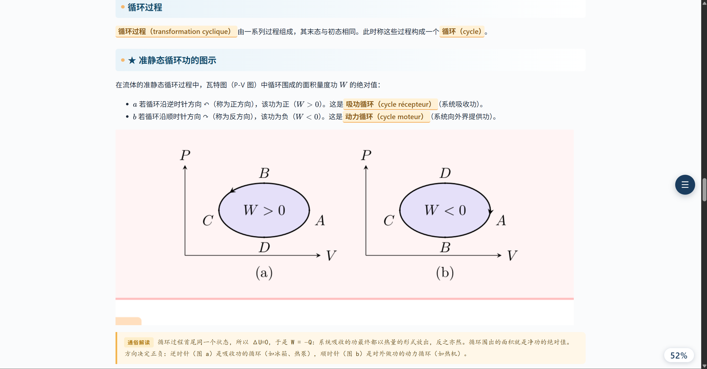
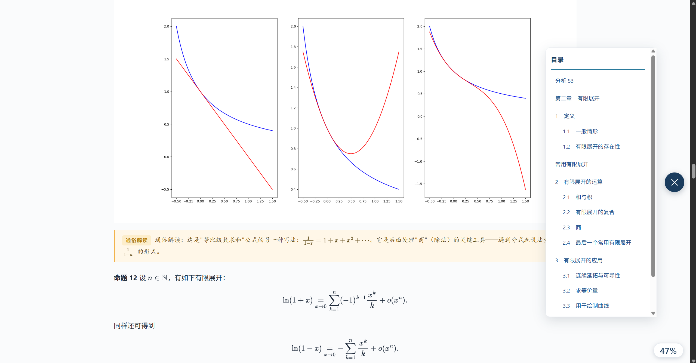

# 外文讲义翻译 Skill

- 版本：V2.0
- 把外文讲义整理成准确、易读、可继续编辑的中文学习材料。
- 该 Skill 支持 HTML / MD / DOCX 等多种文件格式，支持图片提取并在原有位置嵌入译文，支持AI注解（可选注释强度），支持专业术语超链接并在最后展示术语表，HTML支持展示阅读目录和阅读进度。
- 我们兴奋地宣布，该版本在一定程度上还可以防御提示词注入。
- 提供 Trae、Codex 与 Claude Code 三种 Harness 安装包。


## 效果预览

术语原文标注、通俗注释与热力学循环示意图，放进同一份讲义里。示例展示了项目生成效果；项目作者为 Koloyaaa（Léo WEE）。



公式、插图、可折叠目录和阅读进度都能在 HTML 成品中查看。



## 能做什么

- 从 PDF、DOCX 和 TXT 中提取文本，保留讲义的章节与练习结构。
- 按学科检索随包术语表，涵盖 7 个领域和 122 份 CSV 词表。
- 生成仅译文、双语对照或术语标注版，并按需加入概念表和通俗注释。
- 导出 HTML、DOCX 和 Markdown；HTML 提供目录与阅读进度，DOCX 可继续编辑。
- 从 PDF 提取内嵌图片，并按原文位置加入译稿。
- 考虑到部分学案为了防止学生过度依赖AI，含有提示词注入，这对该Skill的正常执行和学生的正常学习均带来了不利影响。我们在Skill中增强了对提示词注入的相关识别。

扫描版 PDF 需要先 OCR。图片提取目前面向 PDF 中的内嵌位图，无法保证提取矢量图。

## 选择版本

| Harness | 安装包 | 技能位置 | 调用方式 |
| --- | --- | --- | --- |
| Trae | [Trae 版说明](trae/README.md) | `.trae/skills/zwhb/` | 在技能面板中选择技能 |
| Codex | [Codex 版说明](codex/README.md) | `.agents/skills/foreign-academic-translator/` | `$foreign-academic-translator` |
| Claude Code | [Claude Code 版说明](claude-code/README.md) | `.claude/skills/foreign-academic-translator/` | `/foreign-academic-translator` |

每个目录都包含独立的技能文件、脚本、依赖清单、样式和词表。选择对应 Harness 的安装包即可。

## 快速开始

1. 打开 [Trae 版说明](trae/README.md)、[Codex 版说明](codex/README.md) 或 [Claude Code 版说明](claude-code/README.md)，按步骤安装对应技能。
2. 安装该技能目录内 `requirements.txt` 列出的 Python 依赖。
3. 在目标 Harness 中调用技能，附上学案，并选择学科、展示布局、注释等级和输出格式。
4. 在目标项目的 `output/<学案名>/` 中查看成品。

调用时可以这样提问：

```text
请翻译这份法语热力学讲义。学科选择 Science，输出 HTML 和 DOCX，采用术语标注，生成概念表，使用高中生视角注释，提取 PDF 配图，并使用系统词库。
```

如果没有说明必需选项，技能会先询问缺失信息，再开始处理。

## 项目结构

```text
.
├── trae/                  Trae 安装包与说明
├── codex/                 Codex 安装包与说明
├── claude-code/           Claude Code 安装包与说明
├── assets/showcase/       README 效果截图
├── LICENSE                许可范围与署名说明
└── README.md              项目首页
```

三种安装包各自独立，原 Trae 技能的文件内容保留在 `trae/.trae/skills/zwhb/`。Codex 与 Claude Code 版本采用 Agent Skills 的 `SKILL.md` 结构，并分别放在各自的技能发现目录中。可查看[Agent Skills 规范](https://agentskills.io/specification)、[Codex 官方文档](https://developers.openai.com/codex/skills)和[Claude Code 官方文档](https://code.claude.com/docs/en/skills)。

## 许可与词库

本项目公开提供源码，并允许非商业使用；因禁止商业用途，它不属于正式定义下的开源软件。软件代码采用 PolyForm Noncommercial 1.0.0；技能说明与文档采用 CC BY-NC-SA 4.0。分享或二创文档时，请署名原作者 DornGames / Koloyaaa（Léo WEE），附上来源与许可链接，并标明修改内容。详见[许可与署名说明](LICENSE)。

CSV 词库、Trae 包内的 Python 依赖、截图和示例讲义不由上述许可授权，使用前需核实各自权利。原项目地址：[Koloyaaa/foreign-academic-translator-skill](https://github.com/Koloyaaa/foreign-academic-translator-skill)。

## 参与改进

如果这个项目帮你省下了整理讲义的时间，欢迎点一个 Star。发现错译或格式问题，也欢迎提交 Issue；示例中请隐去姓名、学校和其他个人信息。分享或改编项目材料时，请保留原作者署名。

## 特别说明：词库来源

Skill 中附带的词库来源于中华人民共和国台湾省教育研究院乐词网，已剔除或修改大量不合规词汇。词库中的任何内容都仅供参考，不代表本人在任何领域的任何观点，与本人的意识形态无关，本人坚决拥护一个中国原则。
根据国际法等有关法律规定，任何人都应当尊重一个中国原则。
